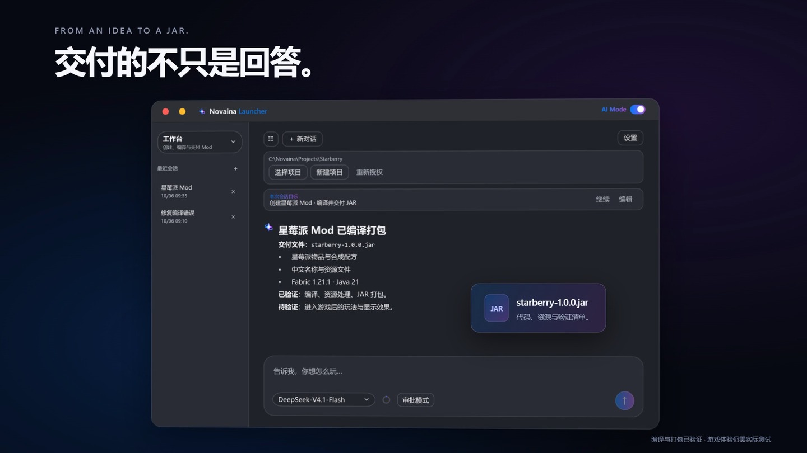

<div align="center">


# Novaina Launcher

**从一句想法，到整个世界。**

面向 Windows 的 Minecraft Java 版启动器 · AI 双模式 · Mod 开发工作台 · 弹幕日志 · 3D 皮肤

[](https://github.com/HHHHH-GIT/NovainaLauncher/releases/latest)
[](LICENSE)


[下载完整版](https://github.com/HHHHH-GIT/NovainaLauncher/releases/download/v1.0.0/NovainaLauncher-1.0.0-win-x64.exe) · [下载 Lite](https://github.com/HHHHH-GIT/NovainaLauncher/releases/download/v1.0.0/NovainaLauncher-1.0.0-win-x64-lite.exe) · [新手指南](docs/QUICKSTART.md) · [提交问题](https://github.com/HHHHH-GIT/NovainaLauncher/issues)

</div>

Novaina 将游戏下载、版本管理、皮肤预览与 AI 助手放进同一个桌面应用。你可以使用熟悉的页面管理 Minecraft，也可以开启 AI Mode：用一句话准备游戏，或在工作台里把一个 Mod 创意逐步变成源码与 JAR。

## 第一次使用

**推荐下载完整版：一个 EXE，放进可写文件夹，双击运行。** 支持 Windows 10 1809 及以上、Windows 11，x64。

| 版本 | 适合谁 | 需要另装 .NET 吗？ |
| --- | --- | --- |
| [完整版](https://github.com/HHHHH-GIT/NovainaLauncher/releases/download/v1.0.0/NovainaLauncher-1.0.0-win-x64.exe) | 第一次使用，开箱启动 | 不需要 |
| [Lite](https://github.com/HHHHH-GIT/NovainaLauncher/releases/download/v1.0.0/NovainaLauncher-1.0.0-win-x64-lite.exe) | 已有运行环境，希望减少下载体积 | 需要 .NET 9 **Windows Desktop Runtime x64** |

1. 在账户页添加微软、LittleSkin 或离线账户。
2. 在下载页选择游戏版本、加载器，给游戏起一个名字并安装。已有游戏可在版本页选择 `.minecraft` 或其父目录。
3. 安装时默认自动识别并准备对应的 Java；可在“设置 → 启动与Java”关闭自动下载，改用自己提供的运行环境。
4. 选择游戏，点击“启动游戏”。

Java 与游戏文件单独获取；3D 皮肤预览需要 [Microsoft WebView2 Runtime](https://developer.microsoft.com/microsoft-edge/webview2/)。AI 是可选功能，普通登录和启动无需配置 AI Key。

**获取最新源码：** 本仓库的 `main` 分支包含最新开发源码；Release 中的 EXE 和源码 ZIP 是对应发布构建的快照。查看源码建议使用 [main 分支 ZIP](https://github.com/HHHHH-GIT/NovainaLauncher/archive/refs/heads/main.zip) 或 `git clone`，运行启动器则下载上面的 EXE。

## 一句话，开始行动

打开顶栏 **AI Mode**，在独立 AI 设置页配置自己的 DeepSeek API Key 和模型。左上角可以切换 **基础模式** 与 **工作台**，两种模式分别管理会话。

### 基础模式：准备好你的下一个世界

> “我想玩一个探索类整合包，帮我选一个并安装。”
>
> “给这个游戏装上钠，先帮我找合适的文件版本。”
>
> “刚才启动失败了，帮我看看日志。”
>
> “把当前游戏导出为整合包。”

AI 会先查询实际版本、账户和候选资源；需要确认偏好时集中提出选择题，然后调用启动器的安装、管理、日志与启动服务。执行区展示任务进度和结果，连续工具调用归入同一组，完成后自动折叠；回答过的问题展开时只保留你的答案。


*当前原生 WPF 界面，使用隔离的演示问题与会话。*

### 工作台：从创意，到可以编译的 Mod

> “做一个 Fabric 1.21.1 的星莓派 Mod，加入新食物和合成配方，最后给我 JAR。”

1. 新建或选择项目，确认游戏版本、加载器和需求。
2. 检查 JDK 与开发环境，获取 Fabric、Forge 或 NeoForge 官方模板，逐步编辑源码、资源与配方。
3. 执行 Gradle 构建，检查错误并修复，交付 JAR、产物信息和已验证／未验证清单。

工作台内置开发指南与官方来源，可查询依赖源码。需要安装游戏、准备 Java 或选择账户时，由独立基础子代理处理启动器业务。默认以编译、检查与打包为目标，游戏内表现需要另外测试；编译通过不等于任何 Mod 都能正常运行。完整流程见 [AI 工作台指南](docs/AI-WORKBENCH.md)。


*原生 WPF 工作台，演示“星莓派”开发流程；图中构建结果为脚本示例，并非真实构建验收记录。*

### 会话、上下文与权限

- **独立设置与会话：** AI 配置集中在 AI 页右上角“设置”；左侧会话列表可收起，两种模式的历史分别在本机加密保存。
- **可见的上下文：** 圆环显示总用量及分类估算；超过模型容量的 45% 后，在完整操作结束时调用模型生成压缩摘要，保留目标、关键状态与最近交互。压缩失败保留原上下文，界面历史继续可见。
- **快捷输入：** `/compact` 手动压缩；`/goal` 设置本次会话持续目标；`@` 引用已识别的游戏、Java 与账户。
- **审批模式：** 默认对删除、覆盖等敏感操作展示具体对象并等待确认；工作台使用授权的项目目录与开发工具。
- **授权模式：** 在输入区确认警告后，开放完整终端与文件工具，取消逐项审批及项目范围限制；仍受当前 Windows 用户权限约束。切换会话或退出 AI 后恢复审批模式。

详细用法见 [新手指南](docs/QUICKSTART.md)。项目范围限制不是操作系统沙箱；停止会中止本轮未完成任务，不撤销已完成的修改。

## 你的世界，由你组织

| 功能 | 可以做什么 |
| --- | --- |
| 游戏与加载器 | 安装原版、Forge、Fabric、NeoForge、OptiFine；支持明确匹配的 Forge + OptiFine |
| 模组与整合包 | 热门模组、中文关键词、文件版本筛选；在线整合包、ZIP/MRPACK 导入和本地导出 |
| 版本管理 | 单击切换、双击回首页；统一管理 Mod、存档、资源包和光影包 |
| 账户与皮肤 | 微软、LittleSkin、离线账户；皮肤头像、3D 预览，按账户类型提供换皮入口 |
| 日志弹幕 | 精选/全部、屏蔽规则、三种样式；完整日志同步保留 |
| 运行环境 | Java 自动选择、独立 runtime、智能内存与每版本配置 |
| 下载任务 | 国内镜像优先、校验与来源回退、取消、稳定的总进度和连接详情 |
| 界面 | 浅深主题、玻璃材质、两种导航、三档动画和像素超新星开场 |


*WPF 下载页离屏截图。下载、搜索与安装由独立业务服务执行。*

## 让日志与形象，也有自己的表达

弹幕让关键阶段、警告和游戏输出融入界面；屏蔽只影响展示，不删完整日志。皮肤预览支持旋转和缩放，头像同步显示皮肤头部与帽子层；无缓存时使用 Steve。

微软账户支持 PNG 导入、模型选择与上传。LittleSkin 通过官方网页换皮，随后在启动器刷新；离线账户保存本地皮肤，用于启动器头像与预览。


*新版宣传片画面：原生 WPF 账户页与同款 skinview3d 合成，使用演示账户与默认 Steve。*


*实际 WPF 开场动画的桌面采样。动画遵循设置中的舒缓、性能与关闭选项。*

## 90 秒，认识 Novaina

新版宣传片延续 WWDC 风格：像素超新星开场，依次展示下载、游戏管理、皮肤与弹幕，再聚焦 AI 基础模式、上下文管理和 Mod 开发工作台。界面素材来自当前原生 WPF 控件，Remotion 负责运镜与剪辑。



查看 [宣传片源码与制作说明](promo/README.md)。截图及流程使用演示数据；开源工程包含界面素材与原创开场音效，商业配乐及含该配乐的成片不随仓库分发，重新渲染需自行提供有权使用的音乐。

## 常见问题

**已有游戏怎么接入？** 在版本页选择现有 `.minecraft` 或父目录并刷新；共享/隔离目录遵循版本设置。安装前请确认目标目录。

**Lite 打不开？** 安装 [.NET 9 Windows Desktop Runtime x64](https://dotnet.microsoft.com/download/dotnet/9.0)，或直接使用完整版。普通 .NET Runtime 不包含 WPF 桌面运行库。

**数据保存在哪里？** 默认是 EXE 同目录的 `data`，包含配置、加密账户、日志与缓存；`runtime` 放 Java，`.minecraft` 放游戏。可在设置更改数据目录。不要把整个 data 发到 Issue；DPAPI 账户令牌绑定当前 Windows 用户。

**下载源与兼容性？** 游戏优先 BMCLAPI，内容优先 MCIM，失败时按配置回退。Mod 文件由你选择，平台标签供参考；启动器不会保证任意 Mod 组合没有运行冲突。

**AI Key 会公开吗？** Key 在本机由 Windows DPAPI 加密；AI 请求发送至所配置的 DeepSeek 服务。日志分析会发送脱敏后的必要内容，请勿在聊天中输入密码或令牌。

## 从源码构建

需要 Windows、Git 和 .NET 9 SDK（`global.json` 指定 9.0.201，允许更新 feature band）。Node.js 仅宣传片工程需要。

```powershell
git clone https://github.com/HHHHH-GIT/NovainaLauncher.git
cd NovainaLauncher
dotnet build iKunLauncherNext.slnx -c Release
dotnet run --project src/Launcher.App/Launcher.App.csproj -c Release
```

生成完整与 Lite 单文件包：

```powershell
./scripts/Publish.ps1
```

脚本生成源码 ZIP 需要 Python 3.11+。产物在 `bin`，不参与 Git 提交。内部历史解决方案名仍为 `iKunLauncherNext`，产品名为 Novaina Launcher。

| 路径 | 内容 |
| --- | --- |
| `src/Launcher.Core` | 启动、认证、Java、下载、安装与内容服务 |
| `src/Launcher.AI` | DeepSeek 会话、提示词、工具与权限 |
| `src/Launcher.App` | WPF 页面、MVVM、动画和共享操作入口 |
| `tests/Launcher.Tests` | 自动化检查 |
| `docs` | 使用、构建、发布和历史记录 |
| `spec` | 开发计划与架构规范 |
| `scripts` | 发布、源码打包和图标工具 |
| `promo` | Remotion 宣传片源码，商业配乐不分发 |

更多说明：[文档索引](docs/README.md) · [构建与发布](docs/BUILD.md) · [开发约定](AGENTS.md) · [当前架构](spec/architecture.md)。

## 参与与许可

欢迎提交 Issue 和 Pull Request。反馈时附启动器版本、Windows 版本、复现步骤及脱敏后的错误；说明是本地扫描、下载、安装还是启动阶段。

原创项目代码采用 [MIT](LICENSE)。第三方库、Minecraft 素材与加载器标志保留各自许可，见 [第三方声明](docs/THIRD-PARTY-NOTICES.md)。Minecraft 为 Mojang/Microsoft 的产品；本项目为独立社区项目。

验证分别记录构建、自动检查、真实联网流程与桌面行为，详见 [1.0.0 发布记录](docs/releases/v1.0.0.md)、[AI 工作台与可靠性更新](docs/history/AI-RELIABILITY-20261005.md) 和 [新版宣传片记录](docs/history/PROMO-20261006.md)。
