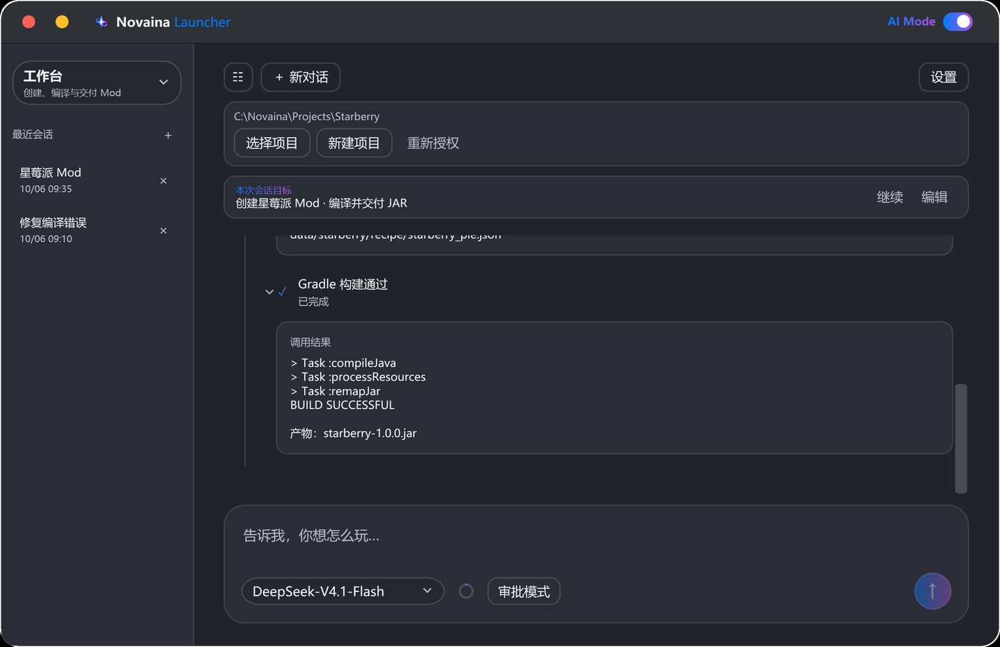
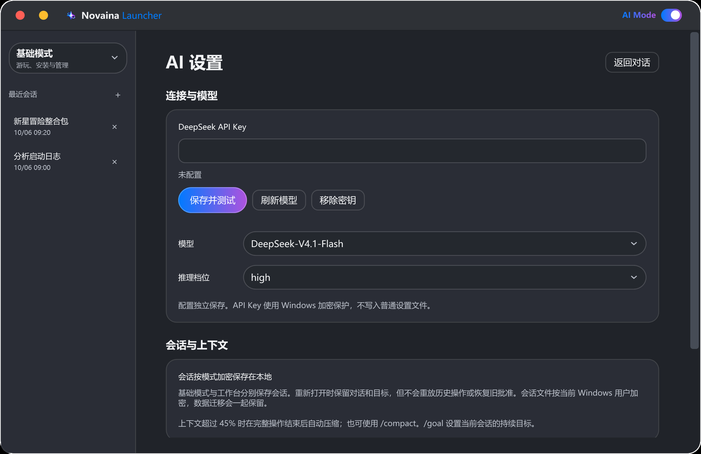

# AI 基础模式与工作台

打开顶栏 **AI Mode**，在左上角选择 **基础模式** 或 **工作台**。两种模式使用同一个 DeepSeek 连接，分别保存会话；普通启动器的设置不再包含 AI 配置。

*原生 WPF 界面离屏截图，使用演示会话；图中“星莓派”构建输出是脚本示例，不是真实构建验收记录。*

## 连接与会话

右上角 **设置** 打开独立 AI 设置页：保存并测试 API Key、刷新和选择模型、选择推理档位、查看会话存储和工作台权限。首次使用仍会引导配置连接。现有 Key 沿用，无需重新输入；原模型偏好会迁移到独立配置。

左侧列表可以收起。模式切换后显示对应模式的历史记录，点击记录继续，**＋** 新建对话，记录右侧 **×** 经确认后删除记录。会话保留消息、已提交的回答、执行摘要、上下文、目标与项目位置；重新打开后先核实真实状态，不重放命令或继承历史批准。

会话按完整操作的安全边界及停止/切换时保存至 `data/ai/conversations/basic` 或 `workbench`，使用当前 Windows 用户的 DPAPI 加密。API Key 保留原加密存储；模型偏好等非敏感配置在 `data/ai/settings.json`。数据目录迁移包含这些文件，但跨 Windows 用户不能保证解密。删除会话不会删除项目、游戏或账户。

## 基础模式：游玩与管理

保留原来的游戏、Mod、整合包、账户、Java、日志分析和启动工作流。选择题、确认卡片、真实任务进度、Markdown、上下文压缩、`/goal`、`/compact` 和 `@` 引用继续可用。

例如：“搜索一个冒险整合包，先让我选择”“分析刚才的启动日志”。基础模式没有工作台的源码编辑或开发终端权限。上述工具隔离针对默认审批模式；授权模式另提供完整工具。

## 工作台：从想法到 Mod

1. **新建项目**：选择保存项目的父目录，启动器创建空目录，再由你确认授权。已有项目用 **选择项目**，应含 `build.gradle` 或 `build.gradle.kts`。
2. 描述功能，并尽量说明 Minecraft 版本与加载器。不清楚时，助手会先集中询问，帮助把目标拆成一个可实现的小功能。
3. 助手读取内置开发指南、查询官方模板、检查 JDK，先编译模板基线，再逐步修改和编译。审批模式首次构建及构建配置改变时，需要确认信任。
4. 完成后显示真实构建结果与 `build/libs` 下的 JAR 路径、SHA256，以及尚未验证的游戏内行为。

可以这样开始：

> “帮我为 Minecraft 1.21.1、NeoForge 做一个新食物，有中文名和合成配方。先实现最小功能，编译通过即可，不启动游戏。”
>
> “检查这个 Fabric 项目的编译错误，先确认映射体系和实际依赖 API，保留现有功能。”

开发需要 **JDK**，只有 `java.exe` 的 JRE 不足以编译。工作台可以委托基础子代理准备指定版本的 JDK；已有 JDK 会出现在环境查询中，构建使用所选 JDK，不随意改变游戏的 Java 设置。

模板来自 Fabric 官方示例、Forge 官方 MDK 与 NeoForge MDKs，固定真实版本/提交。NeoForge 优先 ModDevGradle，缺少时查询同版本的官方 NeoGradle 模板。构建匹配项目 JavaLanguageVersion 声明的 JDK，避免直接使用最高版本。Gradle 使用系统代理，网络与 JDK/编译错误分别提示；首次依赖准备可能需要数分钟。

审批模式下，已有文件替换与删除会显示具体对象和修改预览，并检查读取时的 SHA256，防止覆盖你的同时编辑。开发终端提供 Gradle 构建/检查/测试/源码生成、Java 版本及 Git 只读状态/差异；默认审批模式不能输入任意 Shell 命令。源码和依赖中的实际类可以查询，模型不应凭记忆猜 API。

**构建脚本和插件能够执行代码。审批模式的目录限制不是操作系统沙箱，请只授权可信项目。** 完整终端由用户确认的授权模式开放。默认工作流不擅自上传发布或接受 EULA；本版不包含绘画编辑器。

默认只编译和打包，不自动运行 Minecraft。编译通过不等于功能、Mixin、渲染或多人行为已通过运行验证。只有明确要求游戏内测试时，才使用启动器准备测试实例并确认启动。

## 基础子代理什么时候参与

工作台直接处理源码、资源、项目与编译；独立基础子代理只处理启动器业务准备，如查询/准备 Java、安装测试游戏、现成依赖 Mod、账户登录恢复及实例导入导出。子代理没有项目编辑权限，也不能再次派发子代理；审批模式下沿用人工登录和具体操作确认。授权模式下子代理继承本轮的免审批策略，但仍通过基础工具处理启动器业务，不自动扩大子目标。

例如“缺少 Java 21 JDK，准备好开发环境，不启动游戏”适合委托；“修改注册代码并修复编译错误”必须由工作台完成。

## 停止与恢复

停止、退出 AI 或切换会话会取消当前模型请求、本轮基础子代理及开发进程树，并等待清理。普通下载任务与已经运行的 Minecraft 不受影响。已经写入的源码保留，不冒充全部完成。

恢复工作台会话时显示项目位置，但目录与构建信任需要重新授权。助手重新检查文件、JDK 与构建状态后继续，旧记录只是参考资料。

## 开发指南与验证范围

内嵌九个专题：[总工作流](../src/Launcher.AI/Workflows/workflow.md)、[Fabric](../src/Launcher.AI/Workflows/fabric.md)、[Forge](../src/Launcher.AI/Workflows/forge.md)、[NeoForge](../src/Launcher.AI/Workflows/neoforge.md)、[资源与数据生成](../src/Launcher.AI/Workflows/resources.md)、[客户端/服务端与网络](../src/Launcher.AI/Workflows/sides-network.md)、[测试](../src/Launcher.AI/Workflows/testing.md)、[故障排查](../src/Launcher.AI/Workflows/troubleshooting.md)、[交付](../src/Launcher.AI/Workflows/delivery.md)。各篇附官方来源和审校日期，按需读取。

当前实现与验收结果见 [开发规范](../spec/AI-WORKBENCH.md) 和 [双模式实现记录](history/AI-WORKBENCH-20261005.md)、[滚动/权限/构建/压缩修复记录](history/AI-RELIABILITY-20261005.md)。模型与开发生态都会变化，不能承诺任意需求或任意版本百分之百成功。
## 审批模式与授权模式

输入区的权限按钮可选择 **审批模式** 或 **授权模式**。默认审批模式保留具体操作确认与项目授权。选择授权模式先显示警告，点击 **确认启用** 后，按钮变为警戒色；两种 Agent 模式均可使用完整 PowerShell/cmd 终端、任意文件读取/创建/编辑/移动/复制/删除、目录创建和整合包路径导入导出，不再逐项确认，也不限制项目文件夹。

权限受当前 Windows 用户权限限制，命令可以访问网络。只对当前会话有效；切换/新建会话、退出 AI 或重启时恢复审批模式。停止不会撤销已完成的修改。登录密码和网页登录仍由人类输入。

## 上下文压缩如何工作

用量超过 45% 或输入 `/compact` 后，等待当前模型输出和整批工具操作完整结束，再调用当前 DeepSeek 模型生成结构化交接摘要，保留仍有效的目标、约束、选择、关键文件与实例标识、实现与验证状态、失败原因和待办。

提交摘要时另外保留关键操作事实和最近两轮完整问答及成对工具结果（过大时保留最近一轮）；长日志/输出保留首尾摘录，需要时重新读取。目标与引用单独保留，检查点随加密会话保存。只有收到完整摘要且确实释放空间才替换模型上下文；失败或中止保留原上下文。**界面的对话记录不会因此删除。** LLM 摘要可能遗漏细节，重要要求可继续写入 `/goal` 或在下一轮明确补充。
